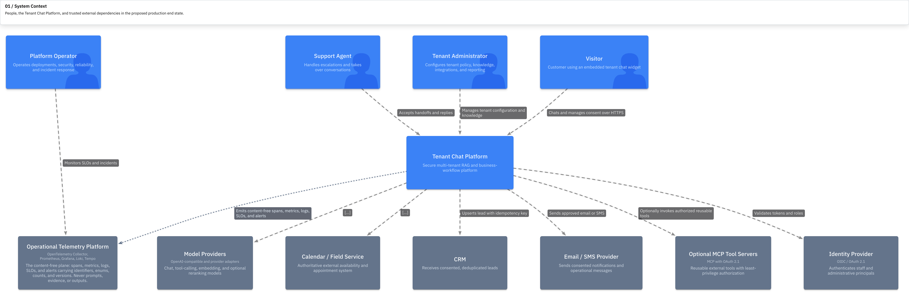

# Tenant Chat Assistant

[](https://github.com/DrMegavolt/tenant-chat-assistant/actions/workflows/ci.yml)

Tenant Chat Assistant is a multi-tenant AI support platform for home-service
companies. It combines retrieval-augmented generation (RAG), appointment and
lead workflows, human handoff, and an operator console.

Demo:
https://github.com/DrMegavolt/tenant-chat-assistant/blob/main/docs/tenant-chat-demo1.mp4

## Features

- Tenant-scoped RAG answers use approved documents and validated citations.
- Deterministic policy checks and idempotent domain services govern bookings,
  leads, and handoffs.
- Turn-level provenance captures routing, retrieved evidence, prompt assembly,
  model rounds, validation results, and the executed graph for operator review.
- Separate telemetry planes keep message and document content out of logs,
  metrics, and operational traces while protecting inference records with
  dedicated access controls and retention.
- Docker Compose and Kubernetes provide complete local and cluster deployment
  paths.

Calendar, CRM, and notification integrations, high availability, disaster
recovery, and load testing are tracked in the [backlog](BACKLOG.md).



## Visitor and operator workflows

The visitor widget can:

- answer questions from approved tenant knowledge and trusted tenant settings;
- show validated sources and refuse answers with weak or invalid evidence;
- check service areas and availability;
- collect a lead or propose a booking, with explicit confirmation before a
  business action is committed;
- request a human handoff; and
- collect per-answer feedback.

The operator console provides chat and handoff queues, knowledge lifecycle
management, answer reviews, an AI turn explorer, tenant memberships, audit
events, and index-integrity findings. The admin API exposes jobs, leads,
bookings, and privacy requests. The API enforces access independently of the
nginx gateway and `oauth2-proxy` authentication layer.

The main runtime is split into three deployable images:

| Image | Responsibility |
| --- | --- |
| `api` | FastAPI, the LangGraph runtime, domain adapters, admin and visitor APIs, and the durable job-worker command |
| `embedding` | The pinned local embedding model and HTTP service |
| `web` | The React builds and nginx gateway for the visitor site, widget, and operator console |

PostgreSQL is authoritative for application state, LangGraph checkpoints, jobs,
and inference turn records. Elasticsearch contains rebuildable search data.
Uploaded source files use the configured object-store adapter; the supplied
Kubernetes deployment mounts a persistent volume for them.

## Repository layout

```text
packages/core/              framework-free domain rules and ports
packages/orchestration/     LangGraph state, nodes, prompts, agents, and tools
services/api/               FastAPI app, persistence, workers, and migrations
services/embedding/         local embedding service
frontend/                   React widget, visitor page, operator console, and nginx
evals/                      versioned offline retrieval and grounding evaluations
architecture/likec4/        architecture source and generated diagrams
docs/                       ADRs, policies, and operational runbooks
k8s/                        reference MicroK8s deployment and observability config
```

The framework boundary is intentional: `packages/core` has no runtime
dependencies, and tests prevent FastAPI, SQLAlchemy, LangGraph, model SDKs, or
network clients from entering it. LangGraph belongs in orchestration; it does
not own authentication, authorization, transactions, or business records. The
reasoning is recorded in [ADR-0001](docs/adr/0001-agent-runtime.md).

## Prerequisites

- Python 3.12
- [uv](https://docs.astral.sh/uv/)
- Node.js 24 and npm
- Docker with Compose
- an OpenAI-compatible chat server such as LM Studio, Ollama, or llama.cpp

The embedding container downloads the pinned model on its first start and is
memory-intensive. Its model cache is kept in a Docker volume.

## Run locally with Docker Compose

Install the locked Python and frontend dependencies and create `.env` from the
safe example:

```bash
make setup
```

Replace every `REPLACE_WITH_*` value in `.env`. Set the external
OpenAI-compatible model that containers can reach:

```dotenv
LLM_MODEL=your-loaded-model
COMPOSE_LLM_BASE_URL=http://host.docker.internal:1234/v1
```

Build and start the complete visitor runtime, verify it, and load governed
sample knowledge:

```bash
make compose-up
make compose-smoke
make compose-seed
```

Open `http://127.0.0.1:8080`. `compose-up` runs PostgreSQL, Elasticsearch,
embedding, both migration systems, the API, durable worker, and the deployed
nginx frontend. The first start may take several minutes while the pinned
embedding model downloads; its cache and application data persist in Docker
volumes.

Compose provides the local visitor runtime. Browser OIDC and the operator
console use the Kubernetes deployment with Keycloak and `oauth2-proxy`. See the
[Docker Compose runbook](docs/runbooks/docker-compose.md) for operation and
troubleshooting, and the [Kubernetes guide](k8s/README.md) for the authenticated
deployment.

To stop the application while keeping its data:

```bash
make compose-down
```

`make down-clean` also deletes the Docker volumes.

## Develop from source

For hot reload, start the infrastructure and embedding container:

```bash
make up-all
```

The Make recipes do not load `.env` into host processes. In each terminal used
for migrations, the API, worker, or seed task, load it first:

```bash
set -a
source .env
set +a
```

Apply migrations, then run the application processes in separate sourced
terminals:

```bash
make migrate
make migrate-checkpoints
make worker
make api
make dev
```

After the API and worker are ready, seed with `make seed-knowledge` and open
`http://127.0.0.1:5173`.

The Vite server also serves the operator-console bundle at `/admin/`, but it
does not impersonate an operator or add identity headers. Use the full nginx,
`oauth2-proxy`, and Keycloak deployment for the browser-based admin workflow.
The [operator-access runbook](docs/runbooks/demo-access.md) covers the
authenticated Kubernetes path.

## Configuration notes

`.env.example` documents every local setting and contains placeholders only.
Important defaults and boundaries:

- `DATABASE_URL` is the application connection. `DATABASE_MIGRATION_URL` is the
  schema-owner connection used only by migrations.
- `PRIVACY_DATABASE_URL` is required by the combined ingestion/privacy worker.
  The local example uses the Compose database owner; deployments use the
  dedicated privacy role.
- `LLM_BASE_URL` and `LLM_MODEL` configure the OpenAI-compatible chat adapter.
  The API reports chat as unavailable when either is missing.
- `CHAT_API_VISITOR_CREDENTIAL_SIGNING_KEY` signs tenant- and session-bound
  visitor credentials. Production startup fails when it is missing.
- `CHAT_API_ALLOWED_ORIGINS` controls direct cross-origin visitor API calls.
  It must never be `*`.
- `ADMIN_GATEWAY_TOKEN` and `ADMIN_CSRF_SECRET` protect operator routes in a
  deployed environment. `CHAT_API_DEV_AUTH=true` is allowed only with a
  loopback database and still requires explicit operator identity headers.
- `CHAT_RAG_REQUIRED=true` makes startup fail when the retrieval path cannot be
  composed. The Kubernetes deployment enables it.

Business records and request rate limits are durable in PostgreSQL. Model token
and action budgets use a process-local ledger: restarts reset it and replicas do
not share it. Explicitly composed tests use in-memory persistence adapters.

## API surface

The public surface contains tenant configuration, availability, signed visitor
sessions, chat turns, consent, confirmation, feedback, and citation source
views. Operator routes cover conversations, handoffs, knowledge, reviews,
traces and replay, jobs, leads, bookings, memberships, audit events, and privacy
requests.

The authoritative route and schema reference is the generated OpenAPI document.
Set `CHAT_API_DOCS_ENABLED=true` for local development and open
`http://127.0.0.1:8080/docs`. Documentation is disabled in the Kubernetes
manifest.

Failures use RFC 9457 Problem Details with a stable `code` and a request ID.
Typed recovery fields such as `missingFields`, `offeredServices`, and
`offeredSlots` keep clients from parsing prose.

## Embedding the widget

The production frontend build emits a self-contained, stable `embed.js`:

```html
<div id="tenant-chat" data-company-id="clearview"></div>
<script type="module" src="https://your-domain.example/embed.js"></script>
```

Optional mount attributes include:

- `data-api-base-url` to point at another API origin;
- `data-open="true"` to start expanded; and
- `data-color-scheme="light"` or `"dark"` to override the host preference.

The widget renders inside a shadow root. A cross-origin installation must add
the customer-site origin to `WIDGET_ALLOWED_ORIGINS`; the nginx gateway applies
that allowlist to both `embed.js` and the visitor API. Admin routes are never
CORS-enabled.

## Testing

The main quality gate is hermetic and needs no running services:

```bash
make check
```

It runs Python and TypeScript linting, formatting and type checks, builds all
three frontend bundles, executes offline evaluation gates, runs both test
suites with coverage, and validates deployment, image, and Grafana contracts.

Database integration tests start disposable PostgreSQL 16 containers:

```bash
make test-database
```

Other useful checks:

```bash
make keycloak-check   # requires Helm
make arch-validate
make images-check     # builds and smoke-tests all deployable images
```

CI also scans dependencies, images, and Git history for vulnerabilities and
committed secrets.

## Documentation

- [Documentation index](docs/README.md)
- [Architecture model and diagrams](architecture/likec4/README.md)
- [Architecture decisions](docs/adr/README.md)
- [Kubernetes deployment](k8s/README.md)
- [Docker Compose runtime](docs/runbooks/docker-compose.md)
- [Database migrations](docs/runbooks/database-migrations.md)
- [Privacy model](docs/privacy.md)
- [Accessibility checks](docs/accessibility.md)
- [Backlog](BACKLOG.md)

## License

[MIT](LICENSE)
